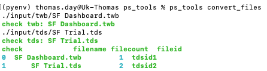
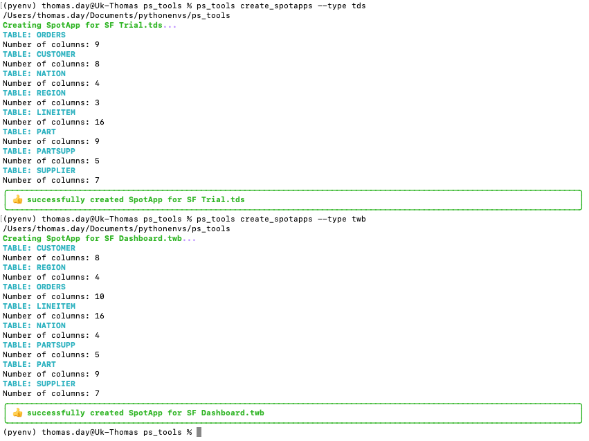
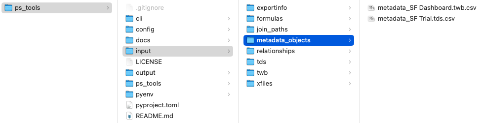
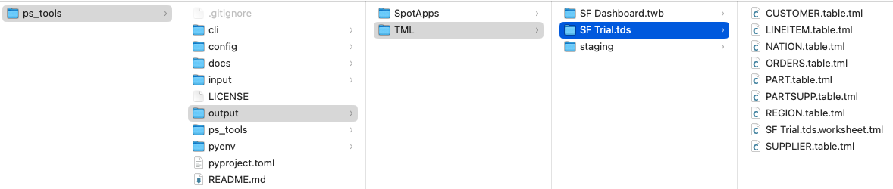
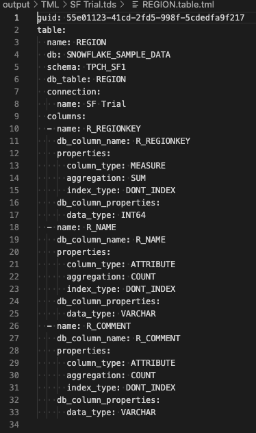
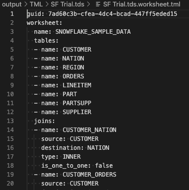
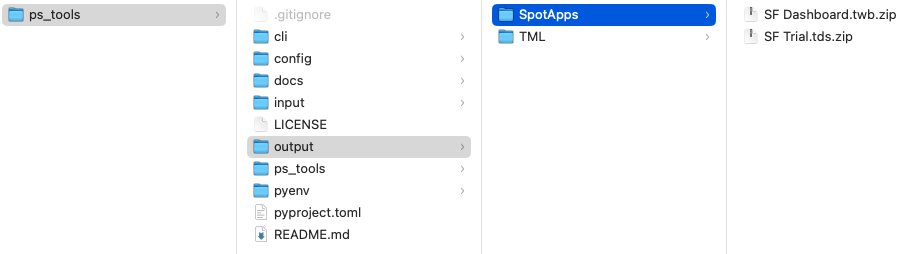

<div align="center">
  <h2><b>PS Tools - Tableau to Thoughtspot</b></h2>
 
  <i>a Command Line Tool to convert tableau data source objects to </i> <b>ThoughtSpot</b> <i>Modeling Language (TML) files programmatically</i>

  <h3>
    <a href="#installation">🛠 Installation</a>
    <span> | </span>
    <a href="#features">📎 Features</a>
    <span> | </span>
    <a href="#migration-to-v200">🚨 Troubleshooting</a>
    <span> | </span>
    <a href="#output">📗 Output</a>
    <span> | </span>
    <a href="#notes-on-thoughtspot-modeling-language">📝 Notes</a>
  </h3>

🚨 __The tools are built on [thougthspot_tml v2.0.0](#migration-to-v200)__. 🚨
</div>

*This package will not perform validation of the constructed TML files or interact with your* __ThoughtSpot__ *cluster!*


## Installation

`ps_tools` requires at least __Python 3.7__, *preferably* __Python 3.9__ and above.

__Installation is as simple as:__
```shell
#Download the zip file from Github
#Create a virtual environment
python -m venv pyenv
source pyenv/bin/activate
pip install -e . 
```

## Features

The following commands are available in the current beta version:


```shell
>>> ps_tools convert_files --help

usage: [--help]  convert_files

positional arguments:
  None         

options:
  -h, --help                show this help message and exit
```

```shell
>>> ps_tools create_spotapps --help

usage: [--help] [--type tds/twb]  create_spotapps

positional arguments:
  None         

options:
  -h, --help                show this help message and exit
  --type                    choose either tds or twb file type
```

## Output
convert_files will create a number of CSV outputs which will be located in the input folder directory.


create_spotapps will create a series of TMLs and Spotapps which will be located in the output folder directory.





## Notes
